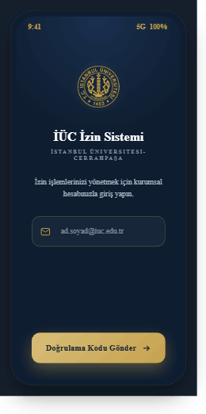
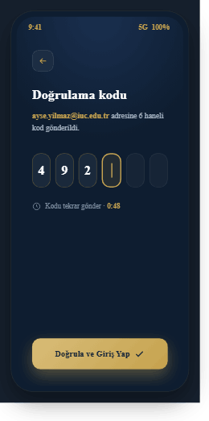
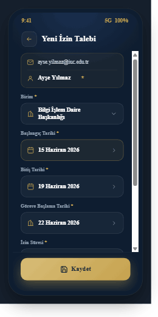
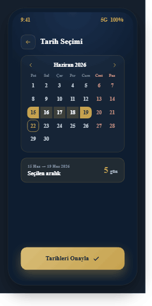
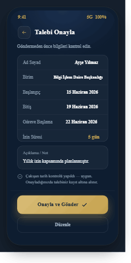
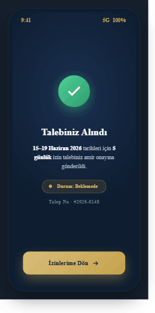
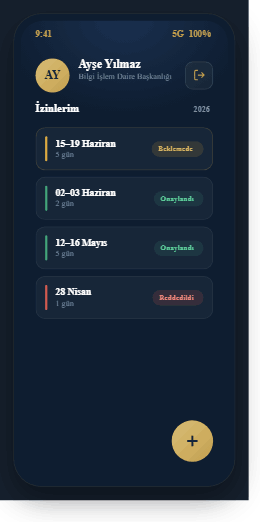

# Handoff: İÜC İzin Sistemi — Personel İzin Uygulaması

## Overview
Mobil (Android öncelikli) bir **personel izin yönetim uygulaması** for İstanbul Üniversitesi-Cerrahpaşa (İÜC). Personel kurumsal e-postasıyla giriş yapar (OTP doğrulama), izin talebi oluşturur (birim, izin süresi, tarihler, açıklama), talebini özetten onaylar ve geçmiş/bekleyen izinlerini listeden takip eder. Kaydedilen talepler bir **Google Sheet**'e yazılır.

Seçilen tasarım yönü: **Premium Koyu** — koyu lacivert yüzey, altın aksanlar, yüksek kontrast.

## About the Design Files
Bu paketteki dosyalar **HTML'de hazırlanmış tasarım referanslarıdır** — amaçlanan görünüm ve davranışı gösteren prototiplerdir, doğrudan kopyalanacak production kodu DEĞİLDİR. Görev, bu tasarımları **hedef ortam olan .NET MAUI** projesinde, MAUI'nin yerleşik desenleri ve kontrolleriyle (XAML + C#, MVVM) yeniden inşa etmektir. HTML/CSS birebir taşınmaz; MAUI eşdeğer kontrolleriyle (Entry, Picker, CollectionView, vb.) kurulur.

- Ana referans: `designs/İÜC İzin — Premium Akış.dc.html` — onaylanan 7 ekranlık uçtan uca akış.
- Karşılaştırma: `designs/İÜC İzin — Tasarım Board.dc.html` — 3 varyasyonlu ilk keşif (A Kurumsal / B Açık / C Premium). Yalnızca bağlam içindir; **C uygulanacaktır**.
- HTML'i tarayıcıda açmak için `designs/support.js` runtime'ı gerekir (yalnızca prototipi görüntülemek için; MAUI'ye taşınmaz).

## Fidelity
**High-fidelity (hifi).** Renkler, tipografi, boşluk ve etkileşimler nihai niyeti yansıtır. UI MAUI kontrolleriyle piksel hassasiyetinde yeniden kurulmalıdır. Telefon çerçeveleri (bezel, çentik, durum çubuğu 9:41/5G/100%) yalnızca sunum amaçlıdır — uygulamaya dahil edilmez; gerçek cihaz status bar'ı kullanılır.

---

## Design Tokens

### Renkler (İÜC kurumsal paleti)
| Token | Hex | Kullanım |
|---|---|---|
| Lacivert (zemin) | `#13263d` | Marka ana rengi, açık temada başlık bandı / metin |
| Lacivert koyu | `#0e1d30` | Premium app zemini (radial gradient tepesi `#1a3050`) |
| Lacivert orta | `#1a3050` | Gradient üst tonu |
| Gri-yeşil | `#313a36` | İkincil koyu (kurumsal dokümandan; UI'da seyrek) |
| Altın | `#c6a24e` | Birincil aksan, CTA, ikon, vurgu |
| Altın açık | `#d8bd78` | CTA gradient üst tonu (`linear-gradient(135deg,#d8bd78,#c6a24e)`) |
| Metin beyaz | `#ffffff` | Koyu zeminde başlık |
| Metin açık | `#a7b6c6` | Koyu zeminde gövde |
| Metin soluk | `#7e93a8` | Koyu zeminde yardımcı / placeholder |
| Yüzey (koyu) | `rgba(255,255,255,.04)` | Kart/input dolgusu |
| Kenar (koyu) | `rgba(255,255,255,.12)` | Input/kart hairline |
| Kenar (altın) | `rgba(198,162,78,.30)` | Aktif/seçili alan kenarı |

### Durum renkleri (status)
| Durum | Metin | Zemin (pill) | Nokta/şerit |
|---|---|---|---|
| Beklemede | `#e0b75e` | `rgba(224,169,58,.14)` | `#e0a93a` |
| Onaylandı | `#5fcb9b` | `rgba(62,166,118,.14)` | `#3ea676` |
| Reddedildi | `#e8857b` | `rgba(214,88,76,.16)` | `#d6584c` |
| Başarı (check) | `#fff` | gradient `#4fcf97→#2e9d6e` | — |

### Tipografi
- **Başlık / display:** Montserrat — 600/700/800. Ekran başlıkları 800 18–22px; kart başlıkları 700 13–16px.
- **Gövde / UI:** Mulish — 400/500/600/700. Gövde 12–13px; etiketler 600 11–12px; overline 600 10–11px, `letter-spacing:1.4–1.6px`, `text-transform:uppercase`.
- MAUI'de: bu iki aileyi `Resources/Fonts/` altına ekleyin (`Montserrat-*.ttf`, `Mulish-*.ttf`), `MauiProgram.cs`'te `ConfigureFonts` ile kaydedin.

### Boşluk & şekil
- Temel grid: 4px. Ekran iç kenar boşluğu: 18–26px.
- **Köşe yarıçapı:** input/buton 13–14px; kart 14–16px; pill/rozet 20px; telefon ekranı 30px (yalnızca prototip).
- **Buton yüksekliği:** birincil CTA 50–52px; ikincil 42px; alan (field) 48px.
- **Gölge (CTA):** `0 10px 26px rgba(198,162,78,.40)`, hover `0 14px 32px rgba(198,162,78,.55)`.

### Animasyon
- `goldPulse` (2.4–2.6s sonsuz): altın halka nabzı — logo halkası, aktif OTP kutusu, FAB, başarı check halkası. `box-shadow:0 0 0 0 rgba(198,162,78,.45)` → `0 0 0 6px rgba(198,162,78,0)`.
- `caret` (1s): aktif OTP kutusunda yanıp sönen imleç.
- Buton hover: `translateY(-2px)` + gölge artışı, ~200ms.
- `prefers-reduced-motion` saygısı önerilir.

---

## Screens / Views (onaylanan akış — 7 ekran)

Akış sırası: **1 E-posta → 2 OTP → 3 İzin Talep Formu → 4 Tarih Seçimi → 5 Talep Özeti/Onay → 6 Talep Alındı → 7 İzin Listesi/Profil**

Her ekranın görsel referansı `screenshots/` klasöründedir (`01-ekran.png` … `07-ekran.png`).

### 1 · E-posta Doğrulama

- **Amaç:** Personel kurumsal e-posta adresini girer, doğrulama kodu ister.
- **Layout:** Dikey ortalı. Üstte altın nabızlı halka içinde İÜC arması (74px). Altında başlık "İÜC İzin Sistemi" (Montserrat 800 21px, `#fff`), overline "İSTANBUL ÜNİVERSİTESİ-CERRAHPAŞA" (`#7e93a8`). Açıklama metni. E-posta input (yükseklik 52px, altın kenar `rgba(198,162,78,.35)`, mail ikonu, placeholder `ad.soyad@iuc.edu.tr`). En altta CTA "Doğrulama Kodu Gönder" (altın gradient, ok ikonu).
- **Davranış:** Geçerli `@iuc.edu.tr` formatı kontrolü; gönderince OTP ekranına geçer ve sunucu OTP üretir/iletir.

### 2 · Giriş · OTP

- **Amaç:** E-postaya gelen 6 haneli kodu gir.
- **Layout:** Geri butonu (sol üst, 36px). Başlık "Doğrulama kodu". `<e-posta>` adresine kod gönderildi metni (e-posta altın vurgulu). 6 adet OTP kutusu (yan yana, yükseklik 58px, radius 14px). Dolu kutular beyaz rakam; **aktif kutu** altın kenar + nabız + yanıp sönen imleç; boş kutular soluk. Altında saat ikonu + "Kodu tekrar gönder · 0:48" geri sayım. Alt CTA "Doğrula ve Giriş Yap" (check ikonu).
- **Davranış:** 6 hane girilince otomatik doğrulama tetiklenebilir. Geri sayım bitince "tekrar gönder" aktifleşir. Hatalı kod → kutular kırmızı hata durumu (error state, aşağıya bakınız).

### 3 · İzin Talep Formu

- **Amaç:** İzin talebinin tüm alanlarını doldur.
- **Layout (kaydırılabilir içerik + sabit alt CTA):**
  - **Başlık:** Geri butonu + "Yeni İzin Talebi" (800 18px).
  - **Kimlik kartı** (altın tonlu, `rgba(198,162,78,.06)`): mail ikonu + e-posta (salt-okunur); ayraç; kişi ikonu + **Ad Soyad** (700 14px) + altın **`*`** (zorunlu/otomatik dolu, hesaptan gelir).
  - **Birim** `*` — combobox (Picker). Değer: "Bilgi İşlem Daire Başkanlığı". Bina ikonu + chevron.
  - **Başlangıç Tarihi** `*` — tarih alanı (vurgulu altın kenar). Takvim ikonu, değer "15 Haziran 2026", sağda `>` (dokununca Ekran 4 açılır).
  - **Bitiş Tarihi** `*` — tarih alanı, "19 Haziran 2026".
  - **Göreve Başlama Tarihi** `*` — tarih alanı, "22 Haziran 2026".
  - **İzin Süresi** `*` — **combobox (Picker)**; kullanıcı gün sayısını listeden kendisi seçer. Değer "5 gün", saat ikonu + chevron.
  - **Açıklama / Not** — çok satırlı metin alanı (Editor), min-yükseklik 72px, placeholder "İzin talebinizle ilgili eklemek istedikleriniz…".
  - **Uyarı notu:** info ikonu + "Aynı veya çakışan tarihler için ikinci bir talep oluşturulamaz."
  - **Sabit alt CTA:** "Kaydet" (disk/save ikonu).
- **Zorunlu alanlar:** Ad Soyad (otomatik), Birim, Başlangıç, Bitiş, Göreve Başlama, İzin Süresi. Açıklama opsiyonel.

### 4 · Tarih Seçimi · Takvim

- **Amaç:** Form'daki tarih alanına dokununca açılan takvim ile aralık seç.
- **Layout:** Geri + "Tarih Seçimi". Takvim kartı: ay başlığı "Haziran 2026" + sol/sağ chevron. Hafta başlıkları **Pazartesi-başlangıçlı** (Pzt Sal Çar Per Cum Cmt Paz); Cmt/Paz kırmızımsı (`#c98b82`). Gün gridi 7 sütun. **Seçili aralık 15–19** altın: uçlar dolu altın (`#c6a24e`, radius uçlarda), aradaki günler açık altın (`rgba(198,162,78,.22)`). **Bugün (22)** altın kenarlı çember. Altında "15 Haz → 19 Haz 2026 · Seçilen aralık" ve sağda "5 gün". Alt CTA "Tarihleri Onayla".
- **Not:** Haziran 2026, 1'i Pazartesi'dir (Pzt-başlangıçlı hizalama doğrudur). Tarih biçimi `dd MMMM yyyy`, `tr-TR` kültürü.
- **Davranış:** Aralık seçimi (başlangıç→bitiş). Onaylayınca forma döner ve seçili tarihleri/gün sayısını günceller.

### 5 · Talep Özeti · Onay

- **Amaç:** Göndermeden önce tüm bilgileri kontrol et.
- **Layout:** Geri + "Talebi Onayla". "Göndermeden önce bilgileri kontrol edin" metni. **Özet kartı** (satır satır, ayraçlı): Ad Soyad, Birim, Başlangıç, Bitiş, Göreve Başlama, İzin Süresi (altın `5 gün`). Ayrı **Açıklama/Not** kartı. Yeşil check ikonlu doğrulama notu: "Çakışan tarih kontrolü yapıldı — uygun. Onayladığınızda talebiniz kayıt altına alınır." Alt: birincil "Onayla ve Gönder" (check) + ikincil "Düzenle" (forma döner).
- **Davranış:** "Onayla ve Gönder" → çakışma kontrolü (server/Sheet) → başarılıysa Ekran 6; çakışma varsa hata.

### 6 · Talep Alındı (Başarı)

- **Amaç:** Talebin alındığını/gönderildiğini onayla.
- **Layout:** Dikey ortalı. Yeşil nabızlı halka içinde gradient yeşil check rozeti (72px). Başlık "Talebiniz Alındı" (800 22px). "15–19 Haziran 2026 tarihleri için 5 günlük izin talebiniz amir onayına gönderildi." Sarı **"Durum: Beklemede"** pill (nokta + metin). "Talep No · #2026-0148" (referans). Alt CTA "İzinlerime Dön".
- **Davranış:** CTA → Ekran 7 (liste, yeni talep en üstte "Beklemede").

### 7 · İzin Listesi · Profil

- **Amaç:** Geçmiş ve bekleyen izinleri listele; profil/çıkış.
- **Layout:**
  - **Üst (profil):** altın gradient avatar dairesi (baş harfler "AY"), Ad Soyad (800 16px), birim alt metni, sağda **Çıkış** ikon butonu (logout, altın stroke).
  - "İzinlerim" başlığı + "2026".
  - **Kompakt satır listesi** (kartlar, `rgba(255,255,255,.04)`): her satırda sol durum şeridi (3px, status rengi), tarih (700 13px) + gün sayısı, sağda **durum rozeti**. Örnek veriler:
    - 15–19 Haziran · 5 gün · **Beklemede**
    - 02–03 Haziran · 2 gün · **Onaylandı**
    - 12–16 Mayıs · 5 gün · **Onaylandı**
    - 28 Nisan · 1 gün · **Reddedildi**
  - **FAB** (sağ alt, 56px, altın gradient, `+`, nabızlı): yeni talep → Ekran 3.

---

## Interactions & Behavior
- **Navigasyon:** Email → OTP → (giriş) → Liste(7) ana ekran. Liste FAB → Form(3) → tarih alanı → Takvim(4) → forma dön → Kaydet → Özet(5) → Onayla → Başarı(6) → Liste(7). MAUI'de Shell + `INavigation` (modal/push) ile kurun; Takvim ve süre seçimi bottom-sheet/popup olabilir.
- **Hover/press:** Web'de hover var; mobilde **pressed state** olarak uygulayın (CTA hafif koyulaşma/ölçek). VisualStateManager ile.
- **Animasyonlar:** `goldPulse` ve `caret` yukarıda. MAUI'de Animation API / Lottie veya basit `Animate` döngüsü.
- **Loading state:** Kod gönderme, doğrulama ve Kaydet sırasında CTA üzerinde spinner + disabled.
- **Error states (eklenecek):**
  - OTP hatalı: kutular kırmızı kenar + "Kod hatalı, tekrar deneyin."
  - **Çakışan tarih:** Kaydet/Onayla'da aynı veya kesişen tarih aralığı varsa kayıt **engellenir**; kırmızı uyarı "Bu tarihler mevcut bir talebinizle çakışıyor." (Tasarım dilinde Reddedildi/danger renkleri kullanılır.)
  - Ağ/Sheet hatası: tekrar dene seçenekli uyarı.

## Form Validation Rules
- Tüm `*` alanlar zorunlu.
- Bitiş ≥ Başlangıç; Göreve Başlama > Bitiş.
- İzin Süresi seçimi tarih aralığıyla tutarlı olmalı (uyumsuzsa uyar).
- **Mükerrer/çakışma engeli:** Kullanıcının mevcut talepleriyle aynı veya kesişen tarih aralığı için ikinci kayıt oluşturulamaz. Kontrol hem istemcide (hızlı geri bildirim) hem Sheet verisine karşı sunucu/servis tarafında yapılmalı.

## State Management (MVVM)
- `AuthState`: email, otpCode, otpExpiry (geri sayım), isVerified, token/oturum.
- `LeaveRequestForm`: adSoyad (read-only, hesaptan), birim, izinSuresiGun, baslangic, bitis, goreveBaslama, aciklama.
- `LeaveList`: ObservableCollection<LeaveItem> { dateRange, days, status (Beklemede/Onaylandı/Reddedildi) }.
- `Profile`: adSoyad, birim, email.
- Geçişler: OTP doğrulama başarısı → oturum; Kaydet → özet; Onayla → Sheet'e yaz → başarı → listeye yeni "Beklemede" ekle.

## Data / Google Sheets Entegrasyonu
- **Kaydet/Onayla** aksiyonunda form verileri bir **Google Sheet**'e yazılır. Önerilen: bir backend/Apps Script Web App ya da Google Sheets API (service account) üzerinden POST; istemciden doğrudan yazım yerine bir aracı servis tercih edin (kimlik/yetki güvenliği için).
- Sheet sütun önerisi: `Zaman Damgası | Ad Soyad | E-posta | Birim | İzin Süresi (gün) | Başlangıç | Bitiş | Göreve Başlama | Açıklama | Durum | Talep No`.
- **Çakışma kontrolü** Sheet'teki mevcut kayıtlara karşı yapılır (aynı kullanıcı + kesişen tarih).
- Liste ekranı aynı Sheet'ten okur (kullanıcıya ait satırlar).

## Assets
- `assets/iuc-arma.png` — İÜC arması (altın amblem, **şeffaf zemin**, 1081×1080 PNG). Splash/giriş ve uygulama ikonu için uygundur. Koyu lacivert üzerinde kullanılır.
- `assets/iuc-logo-yatay.jpg` — İÜC yatay logo (altın, lacivert bantlı). Lacivert zeminlerde kullanılır (zemini bakılı olduğundan açık zeminlerde tercih edilmez).
- İkonlar: prototипte inline stroke SVG (mail, lock, calendar, building, clock, chevron, arrow, check, logout, user, info). MAUI'de eşdeğer line-icon seti (örn. açık kaynak bir ikon fontu) ile, 1.8–2px stroke, altın/soluk tonlarda uygulayın.
- Fontlar: Montserrat + Mulish (Google Fonts).

## Files
- `designs/İÜC İzin — Premium Akış.dc.html` — **onaylanan 7 ekran** (uygulanacak referans).
- `designs/İÜC İzin — Tasarım Board.dc.html` — 3 varyasyon karşılaştırması (yalnızca bağlam).
- `designs/support.js` — prototip runtime'ı (yalnızca HTML'i tarayıcıda görüntülemek için; MAUI'ye taşınmaz).
- `assets/` — marka varlıkları.

> Tarayıcıda görüntülemek için `.dc.html` dosyasını açmanız yeterli (yanında `support.js` ve `assets/` bulunmalı). Bu dosyalar referanstır; uygulama .NET MAUI'de yeniden kurulacaktır.
